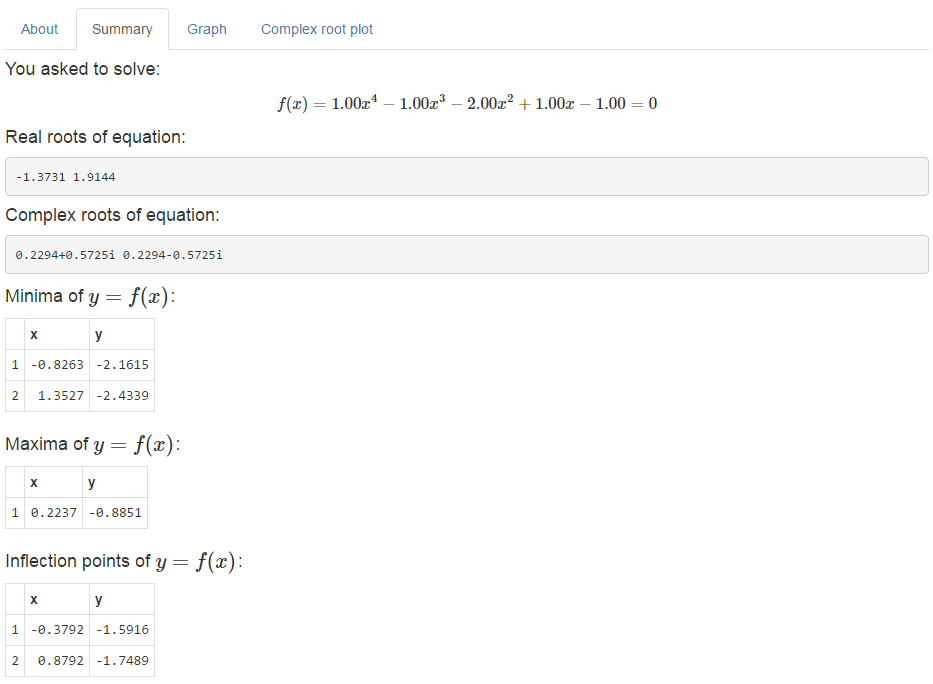

## Short Intro

1. What is it?
>* A simple app that solves a quartic (4-th order) equation of the form $$A_0 + A_1 x + A_2 x^2 + A_3 x^3 + A_4 x^4 = 0.$$

2. How does it work?
>* User gets to input coefficients \\(A_0\\), \\(A_1\\), ..., \\(A_4\\)
>* The app will solve the equation, tell you the results, and even make some plots!

3. Why this app?
>* Some maths once in a while is fun!

--- .class #id 


## What It Does: Root Computation and More

>* Let's assume you input \\(A_0=-1\\), \\(A_1=1\\), \\(A_2=-2\\), \\(A_3=-1\\) and \\(A_4=1\\).

>* The app will display its computation, like this:
<center><div>
  
</div></center> 


--- .class #id

## And It Also Make Those Plots Below

```{r, fig.width=14, fig.height=6, cache=FALSE}
A0 <- -1; A1 <- 1; A2 <- -2; A3 <- -1; A4 <- 1
source('quartic.R'); source('quarticPlot.R')
sol <- quartic(A0,A1,A2,A3,A4); quarticPlot(sol)
```


## See for Yourself

>* App URL (shinyApp):

>* App source code (GitHub):

>* Presentation source code:

--- .class #id

